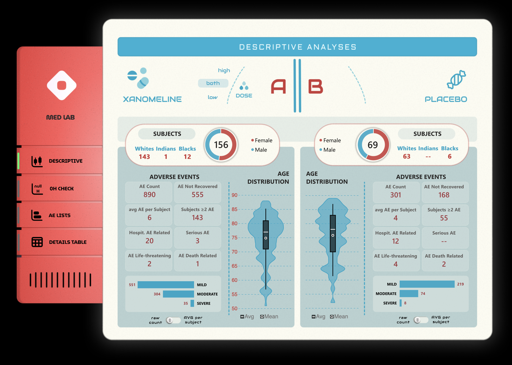
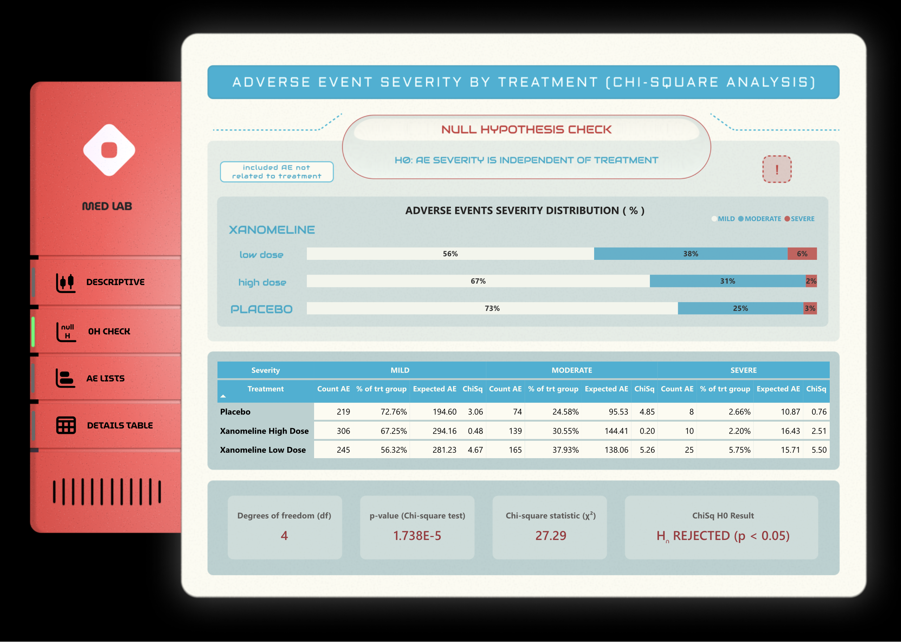

# MEDICATION ADVERSE EVENTS SAFTY ANALYSIS IN POWER BI

---

## ⚠️ Disclaimer

> **All analyses are exploratory and illustrative; no clinical or safety conclusions should be inferred.**
> **This project uses synthetic CDISC-style clinical trial data for demonstration and educational purposes.**

---

---

## Table of Contents
1. [Project Overview](#project-overview)
2. [Objectives](#objectives)
3. [Dataset](#dataset)
4. [Report Structure](#report-structure)
5. [Report Interface](#report-interface)
6. [Main Insights](#main-insights)
7. [Requirements](#requirements)
8. [Contributing](#contributing)
9. [License](#license)
10. [Credits and Acknowledgements](#credits-and-acknowledgements)
11. [Author](#author)

---
## Project Overview

This repository contains the **MEDICATION ADVERSE EVENTS SAFTY REPORT** created in Power BI.

It presents an exploratory safety analysis of adverse events (AEs) from publicly available synthetic clinical trial data derived from the CDISC Pilot Project. The data mimics the structure and relationships of real clinical trial adverse event data but does not represent real patients.
The analysis focuses on comparing the distribution of adverse event severity across treatment groups using AE-level data. Statistical methods, including the Chi-square test of independence, are applied to evaluate whether AE severity is associated with treatment assignment.

Interactive dashboards built in Power BI are used to visualize observed versus expected AE counts, highlight key drivers of statistical significance, and communicate results in a transparent and regulatory-aware manner. The project emphasizes correct statistical interpretation, clear methodology, and practical limitations of AE-only data.

[OPEN REPORT ON MICROSOFT SERVICES](https://app.powerbi.com/view?r=eyJrIjoiOGZlYmM0N2MtMWQ2NS00NDA2LWFhMTktYjI5OTc5NmQ3NGE2IiwidCI6IjU5YTZhM2Y5LTMwYWItNDBmZi1hNDZhLWYzZThkZDU4OGZhOSIsImMiOjl9)

---
### Tools Used
- **Power BI** – for building the dashboard
- **Figma** – for design prototyping

**Key Components:**
- Dataset: `adae.csv`
- Power BI file: `AE_pills.pbix`

---

## Objectives

### Project Goals
- Explore adverse event severity patterns across treatment and placebo groups  
- Assess the association between treatment and AE severity using the Chi-square test of independence  
- Identify key contributors to statistical significance through expected counts and chi-square cell contributions  
- Demonstrate proper hypothesis testing workflow, including definition of H₀, degrees of freedom, and p-value interpretation  
- Build regulatory-style interactive dashboards that clearly separate AE-level and patient-level interpretations  
- Apply best practices for safety analysis visualization, including severity distributions and contribution heatmaps  
- Highlight methodological limitations of AE-level data and outline patient-level analytical alternatives  
- Showcase practical Power BI and DAX techniques for statistical analysis and clinical data reporting  

---

## Dataset
Source: https://github.com/sas2r/clinical_fd/blob/master/adae.csv

Synthetic

**Size:** 1191 rows 

| Variable     | Description |
|--------------|-------------|
| studyid      | Study identifier; unique code for the clinical trial |
| siteid       | Site number / study center where the patient was treated |
| usubjid      | Unique subject identifier across the study |
| trta         | Actual treatment the subject received (text) |
| trtan        | Numeric code for the treatment received |
| age          | Subject age in years at baseline |
| agegr1       | Age group category (text) |
| agegr1n      | Numeric code for age group |
| race         | Subject race (text) |
| racen        | Numeric code for race |
| sex          | Subject sex (M/F) |
| saffl        | Safety population flag (Y/N) |
| trtsdt       | Treatment start date (YYYY-MM-DD) |
| trtedt       | Treatment end date (YYYY-MM-DD) |
| astdt        | Adverse event start date |
| astdtf       | AE start date imputation flag |
| astdy        | AE start day relative to treatment start |
| aendt        | AE end date |
| aendy        | AE end day relative to treatment start |
| adurn        | AE duration (numeric) |
| aduru        | AE duration units |
| aeterm       | Adverse event term (verbatim) |
| aellt        | Adverse event standardized lower-level term |
| aelltcd      | Code for standardized lower-level term |
| aedecod      | MedDRA preferred term |
| aeptcd       | MedDRA preferred term code |
| aehlt        | MedDRA high-level term (HLT) |
| aehltcd      | HLT code |
| aehlgt       | MedDRA high-level group term (HLGT) |
| aehlgtcd     | HLGT code |
| aebodsys     | Body system affected (SOC) |
| aesoc        | Adverse event system organ class (text) |
| aesoccd      | SOC code (MedDRA) |
| aesev        | AE severity |
| aeser        | Serious adverse event flag (Y/N) |
| aescan       | Cancer-related AE flag (Y/N) |
| aescong      | Congenital anomaly flag (Y/N) |
| aesdisab     | Disability flag (Y/N) |
| aesdth       | Death related to AE flag (Y/N) |
| aeshosp      | Hospitalization flag (Y/N) |
| aeslife      | Life-threatening flag (Y/N) |
| aesod        | Other medically important event flag (Y/N) |
| aerel        | Relationship of AE to study treatment |
| aeacn        | Action taken with study drug due to AE |
| aeout        | AE outcome |
| aeseq        | Sequence number of AE for the subject |
| trtemfl      | AE occurred during treatment exposure flag (Y/N) |
| aoccfl       | Flag for AE of interest (Y/N) |
| aoccsfl      | Serious AE occurrence flag (Y/N) |
| aoccpfl      | AE leading to permanent discontinuation flag (Y/N) |
| aocc02fl     | Alternative AE severity flag |
| aocc03fl     | AE flag for hospitalization or medical attention |
| aocc04fl     | AE flag for life-threatening event or death |
| cq01nam      | Custom question or questionnaire item name |
| aocc01fl     | Custom AE occurrence flag (Y/N) |

---

## Report Structure

1. **DESCRIPTIVE ANALYSIS**  
   General dataset overview, adverse event counts, age and gender distribution.

2. **ADVERSE EVENT SEVERITY STATISTICS — NULL HYPOTHESIS TESTING**  
   Severity distributions (%), Chi-square test of independence (H₀: AE severity is independent of treatment).

3. **ADVERSE EVENTS LIST COMPARISON BY TREATMENT GROUPS**  
   Comparison of AE terms across treatment groups; identification of treatment-specific events.

4. **DETAILED AE TABLE BY SUBJECT**  
   Pivot table by treatment and subject with AE details and medical flags, including interactive filtering.

---

## Report Interface

  

---

## Main Insights

- Adverse event severity is **not evenly distributed across treatment groups**.
- A Chi-square test indicates a **statistically significant association** between treatment assignment and AE severity (p < 0.05).
- **Xanomeline Low Dose** shows a higher-than-expected proportion of **MODERATE and SEVERE** adverse events and a lower proportion of **MILD** events.
- **Placebo** is associated with fewer MODERATE adverse events than expected, suggesting a milder AE severity profile.
- **Xanomeline High Dose** shows an AE severity distribution close to expected values, contributing less to the overall Chi-square statistic.
- Statistical significance is driven by **specific treatment–severity combinations**, rather than uniform differences across all groups.
- The analysis is based on **AE-level data**, describing patterns of reported events rather than patient-level risk.

### Severe events distinct to medication treatment groups:
- Syncope  
- Blister  
- Application site warmth  
- Stupor  
- Transient Ischaemic Attack  

---

## Requirements

To open and use the app:

1. Install **Power BI Desktop** (version 2.149.1429.0 recommended) from the [official website](https://www.microsoft.com/en-us/download/details.aspx?id=58494).  
2. Open the file: `MarketingProject.pbix`  
3. To update the dataset, reconnect the `.csv` files from the Dataset folder using **Power Query**.

---

## Contributing

Please follow standard best practices:

- Fork the repository  
- Create a feature branch  
- Commit with clear messages  
- Open a Pull Request

For regular contributions, consider adding:

- `CONTRIBUTING.md`  
- `CODE_OF_CONDUCT.md`

---

## License

This project is licensed under the **MIT License**.  
[View License](https://opensource.org/licenses/MIT)

---

## Credits and Acknowledgements

Development issues were resolved using official documentation, community forums, and online resources, including YouTube tutorials.

---

## Author

**Volodymyr Babunych**  
📧 [vbabunych@gmail.com](mailto:vbabunych@gmail.com)  
📍 United Kingdom  
🗓️ December 31, 2025  
